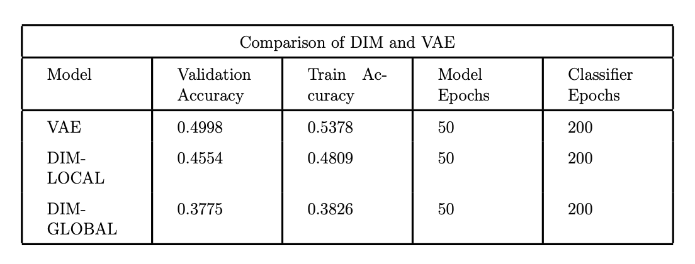

# Team Members:

* Sarvesh Shashidhar(24M2152)
* Ritik (24M2155)
* Ankish Chandresh(24M2163)


# Link to PPT:
[PPT](https://docs.google.com/presentation/d/1BMU7EviwuHqcDCnZIZ4YmI8hsJqJNlhSFbIxaF6y_-s/edit?usp=sharing)

# Link to Referenced repository and code:
[jenkspt/deepinfomax](https://github.com/jenkspt/deepinfomax/tree/master)


# Run The following for DIM-Global:
DIM-Global refers to the setting where purely Global Mutual Information maximisation is performed
```
python trainer.py --alpha=1 --beta=0 --gamma=0 --epochs=50 --batch-size=128
```
# Run The following for DIM-Local:
DIM-Global refers to the setting where purely Local Mutual Information maximisation is performed
```
python trainer.py --alpha=0 --beta=1 --gamma=0 --epochs=50 --batch-size=128
```
# Run the following for Training VAE:
```
python trainVAE.py
```
# Link to our paper:
[Learning deep representations by mutual information estimation and maximization](https://arxiv.org/pdf/1808.06670)
# Results

# References
[Causal models on probability spaces](https://arxiv.org/abs/1907.01672)

[What Makes for Good Views for Contrastive Learning?](https://arxiv.org/abs/2005.10243)

[Analyzing Inverse Problems with Invertible Neural Networks](https://arxiv.org/abs/1808.04730)

[A Simple Framework for Contrastive Learning of Visual Representations](https://arxiv.org/abs/2002.05709)

[Contrastive Learning Inverts the Data Generating Process](https://arxiv.org/abs/2102.08850)


